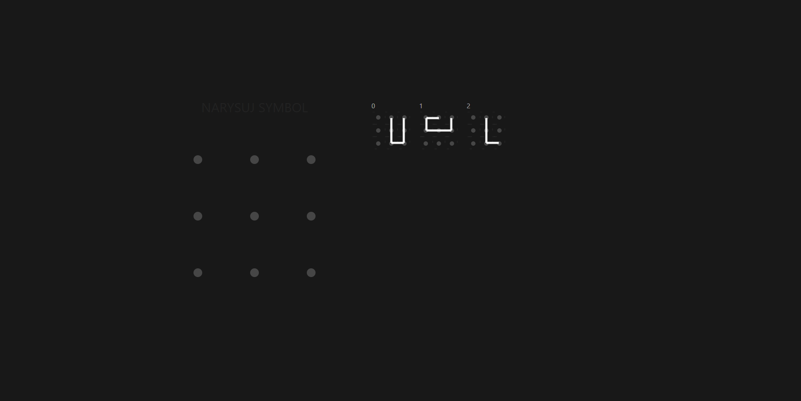
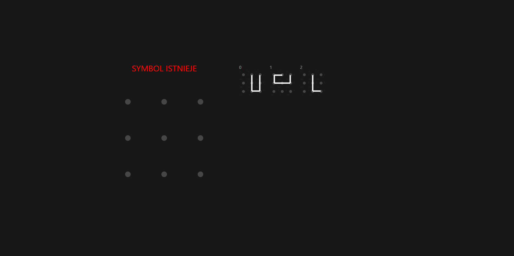

# pin-checker

App helps managing passed symbols, when you forgot your one.

This is only sample app for portfolio purposes. I do not provide maintenance and warranty!

## Screenshots






## Setup

`Develpoed with node 20.9.0`

```sh
npm install
```

```sh
npm run dev
```

## Build

```sh
npm run build
```